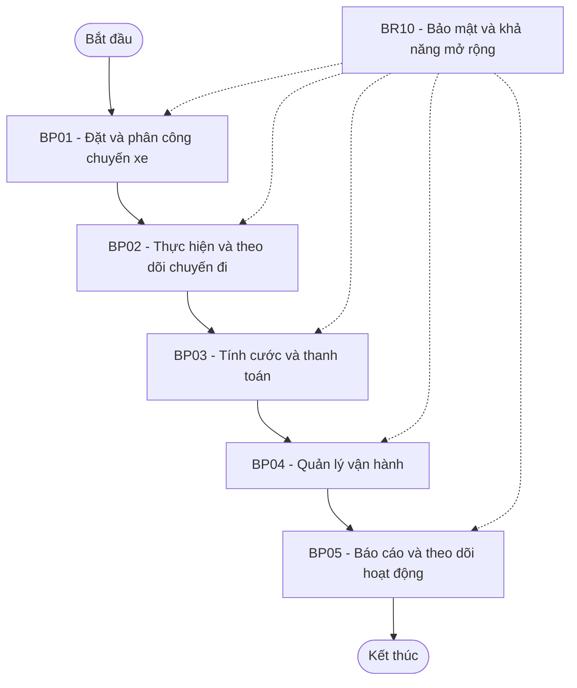
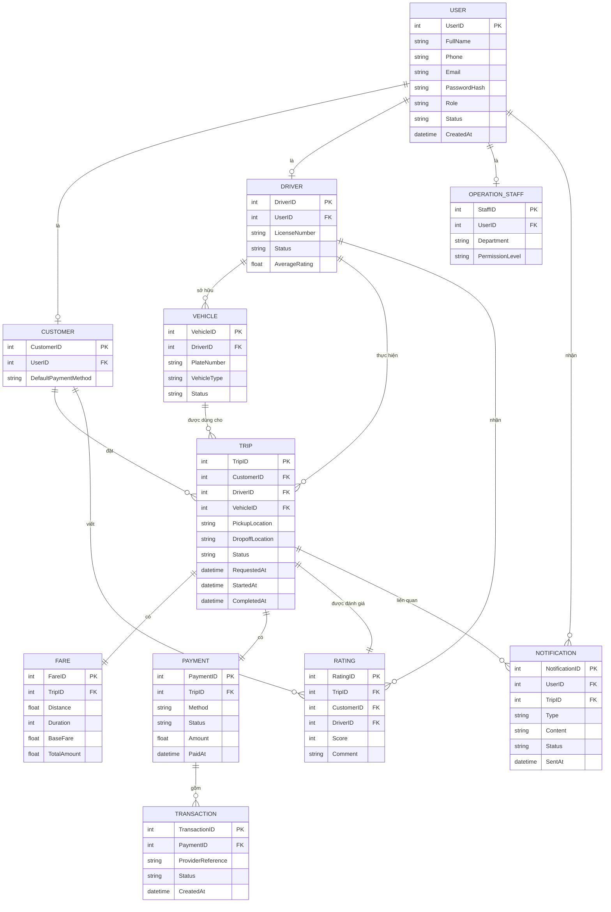

## B1 đọc và phân tích yêu cầu , hiểu về bussiness contest , xđ bussiness prolem, ngữ cảnh nghiệp vụ , KH cần giải quyết vấn đề mà hệ thống không xử lý được , mục tiêu , giá trị hệ thống , giá trị hệ thống mới khác gì hệ thống cũ
1. Tổng quan bài toán

Công ty ABC đang cung cấp dịch vụ đặt xe trực tuyến. Hiện tại khách hàng có thể yêu cầu xe thông qua tổng đài hoặc một ứng dụng đơn giản.
Tuy nhiên, hệ thống hiện tại chưa đáp ứng tốt quy trình vận hành khi số lượng khách hàng và tài xế tăng lên. Nhiều hoạt động vẫn phụ thuộc vào nhân viên và xử lý thủ công, trong khi khách hàng thiếu khả năng theo dõi chuyến đi theo thời gian thực.
Do đó, ABC muốn xây dựng một CAB System mới không chỉ phục vụ việc đặt xe mà còn quản lý xuyên suốt quy trình:
Đặt xe → Tìm tài xế → Phân công → Thực hiện chuyến → Tính cước → Thanh toán → Thông báo → Đánh giá → Báo cáo
Mục tiêu dài hạn là xây dựng một nền tảng có thể mở rộng thêm dịch vụ, phương thức thanh toán, kênh thông báo và các thành phần kỹ thuật mới mà không phải xây dựng lại toàn bộ hệ thống.

2. Business Context – Bối cảnh nghiệp vụ
2.1. Doanh nghiệp đang làm gì?
ABC cung cấp dịch vụ kết nối:
- Khách hàng có nhu cầu di chuyển.
- Tài xế cung cấp dịch vụ vận chuyển.
- Nhân viên vận hành quản lý và hỗ trợ toàn bộ hoạt động.
Hệ thống CAB đóng vai trò là nền tảng trung gian giúp ba nhóm này phối hợp với nhau.

2.2. Quy trình nghiệp vụ hiện tại
Quy trình hiện tại có thể mô tả khái quát:
- Khách hàng yêu cầu đặt xe.
- Yêu cầu được tiếp nhận qua tổng đài hoặc ứng dụng đơn giản.
- Nhân viên/tổ chức vận hành thực hiện việc tìm và phân công tài xế.
- Tài xế nhận chuyến.
- Tài xế thực hiện chuyến.
- Khách hàng thanh toán.
- Thông tin chuyến đi và thanh toán được lưu lại.
- Nhân viên vận hành hỗ trợ khi có sự cố.

Điểm yếu của quy trình là nhiều bước chưa được tự động hóa và dữ liệu chưa được quản lý tập trung.

3. Business Problem – Vấn đề nghiệp vụ

3.1. Vấn đề cốt lõi

ABC chưa có một nền tảng đặt xe đủ khả năng tự động hóa và quản lý xuyên suốt toàn bộ vòng đời của một chuyến xe.
Điều này dẫn đến các vấn đề:

Vấn đề 1 – Phân công tài xế thủ công
Việc tìm và phân công tài xế chủ yếu được thực hiện thủ công.

Hệ quả:

Mất thời gian xử lý.
Khó ưu tiên tài xế gần khách hàng.
Khó xử lý nhanh khi tài xế từ chối.
Khó mở rộng khi số lượng chuyến tăng.
Phụ thuộc nhiều vào nhân viên vận hành.

Vấn đề 2 – Khách hàng thiếu khả năng theo dõi chuyến
Khách hàng khó biết:
Hệ thống đang tìm tài xế hay chưa.
Tài xế nào đã nhận chuyến.
Tài xế đang ở đâu.
Khi nào tài xế dự kiến đến.
Chuyến đang ở trạng thái nào.
Điều này làm giảm tính minh bạch và trải nghiệm khách hàng.

Vấn đề 3 – Thanh toán chưa được quản lý tập trung
Thông tin thanh toán chưa được quản lý thống nhất.
Doanh nghiệp cần:
Tính cước.
Theo dõi kết quả thanh toán.
Hỗ trợ tiền mặt và thanh toán điện tử.
Xử lý giao dịch thất bại.
Tra cứu lịch sử giao dịch.

Vấn đề 4 – Khó mở rộng hệ thống
Hệ thống hiện tại không được định hướng như một nền tảng dài hạn.
Khi số lượng khách hàng, tài xế và chuyến đi tăng, hệ thống có nguy cơ khó đáp ứng tải.

Vấn đề 5 – Khó quản lý vận hành
Nhân viên cần theo dõi:
Chuyến đang diễn ra.
Trạng thái tài xế.
Khách hàng.
Phương tiện.
Giao dịch.
Các chuyến bị lỗi.

Nhưng hệ thống hiện tại chưa cung cấp một giao diện quản trị đầy đủ.

Vấn đề 6 – Thiếu dữ liệu phục vụ quản trị
Ban lãnh đạo cần các chỉ số:
Số lượng chuyến.
Doanh thu.
Tỷ lệ hoàn thành.
Tỷ lệ hủy.
Hiệu quả hoạt động tài xế.

Do đó hệ thống mới phải tạo ra dữ liệu có cấu trúc để phục vụ báo cáo.

Vấn đề 7 – Khó xử lý ngoại lệ
Các tình huống như:
Tài xế không phản hồi.
Tài xế từ chối.
Không tìm được tài xế.
Thanh toán thất bại.
Mất kết nối mạng.
Chuyến bị lỗi.
chưa được xác định đầy đủ về cách xử lý.

4. Business Need – Nhu cầu nghiệp vụ

ABC cần một nền tảng CAB có khả năng:

Tự động tiếp nhận yêu cầu đặt xe.
Tự động tìm tài xế phù hợp.
Theo dõi trạng thái chuyến.
Quản lý vị trí tài xế.
Tính cước.
Hỗ trợ nhiều phương thức thanh toán.
Gửi thông báo cho khách hàng và tài xế.
Quản lý khách hàng, tài xế, phương tiện và chuyến đi.
Phân quyền nhân viên vận hành.
Lưu vết các thao tác quan trọng.
Cung cấp báo cáo quản trị.

Có kiến trúc đủ linh hoạt để mở rộng trong tương lai.


## B2 xđ stackholder , lập bảng cột 1 những stackholder nào , cột 2 vai trò của mỗi ng , dưới bảng vẽ ma trận stackholder metrix
| Stakeholder | Vai trò |
|---|---|
| **Khách hàng (Customer)** | Người sử dụng CAB để đăng ký, đặt xe, theo dõi chuyến, thanh toán, xem lịch sử và đánh giá tài xế. |
| **Tài xế (Driver)** | Người cung cấp dịch vụ vận chuyển; nhận/từ chối chuyến, cập nhật trạng thái chuyến, vị trí và hoàn thành chuyến. |
| **Nhân viên vận hành (Operation Staff)** | Theo dõi hoạt động, quản lý khách hàng, tài xế, phương tiện, chuyến đi và xử lý sự cố. |

## 2.1. Stakeholder Matrix

Stakeholder Matrix được phân tích dựa trên 2 tiêu chí:

- **Power:** Mức độ quyền lực/ảnh hưởng đến dự án.
- **Interest:** Mức độ quan tâm đến hệ thống.

| | **Interest thấp** | **Interest cao** |
|---|---|---|
| **Power cao** | **KEEP SATISFIED**  <br>Administrator  <br>Payment Provider  <br>IT/Technical Team | **MANAGE CLOSELY**  <br>Ban giám đốc  <br>Nhân viên vận hành  <br>Khách hàng  <br>Tài xế  <br>Business Analyst |
| **Power thấp** | **MONITOR**  <br>Notification Provider | **KEEP INFORMED**  <br>Development Team |

### Stakeholder Matrix

```text
                         INTEREST
                  Thấp                  Cao
                   │                     │
       ┌───────────┼─────────────────────┐
       │           │                     │
       │  KEEP     │   MANAGE CLOSELY    │
 CAO   │ SATISFIED │                     │
POWER  │           │ • Ban giám đốc      │
       │ • Admin   │ • Nhân viên vận hành│
       │ • Payment │ • Khách hàng        │
       │   Provider│ • Tài xế            │
       │ • IT      │ • BA                │
       │           │                     │
       ├───────────┼─────────────────────┤
       │           │                     │
       │  MONITOR  │   KEEP INFORMED     │
 THẤP  │           │                     │
       │ • Notify  │ • Development Team  │
       │   Provider│                     │
       │           │                     │
       └───────────┴─────────────────────┘
```
## B3. Xác định Business Goal

| Mã | Business Goal | Ý nghĩa |
|---|---|---|
| **BS01** | Tăng hiệu quả thanh toán | Hỗ trợ tính cước và thanh toán nhanh chóng, thuận tiện cho khách hàng. |
| **BS02** | Giảm thời gian tìm và phân công tài xế | Tự động tìm và phân công tài xế phù hợp, ưu tiên tài xế gần khách hàng. |
| **BS03** | Giảm tỷ lệ hủy chuyến | Hạn chế tình trạng chuyến bị hủy khi tài xế từ chối hoặc không phản hồi. |
| **BS04** | Tăng tỷ lệ chuyến xe hoàn thành | Nâng cao khả năng hoàn thành chuyến và hiệu quả hoạt động của hệ thống. |
| **BS05** | Nâng cao khả năng theo dõi và quản lý chuyến đi | Cho phép khách hàng và nhân viên theo dõi trạng thái chuyến đi rõ ràng. |
| **BS06** | Tăng khả năng mở rộng và phát triển hệ thống | Đảm bảo hệ thống có thể phục vụ nhiều khách hàng, tài xế và bổ sung tính năng trong tương lai. |


## B4. Xác định phạm vi dự án

### Trong phạm vi (In Scope)

- Quy trình đặt xe từ khi khách hàng tạo yêu cầu.
- Tự động tìm và phân công tài xế.
- Tài xế nhận và thực hiện chuyến.
- Theo dõi và cập nhật trạng thái chuyến đi.
- Tính cước và hỗ trợ thanh toán.
- Gửi thông báo cho khách hàng và tài xế.
- Quản lý cơ bản khách hàng, tài xế và chuyến đi cho nhân viên vận hành.

### Ngoài phạm vi (Out of Scope)

- Xây dựng hệ thống bản đồ/GPS riêng.
- Tự xây dựng hệ thống thanh toán điện tử; chỉ tích hợp với nhà cung cấp bên ngoài.
- Các loại dịch vụ mới chưa được xác định trong giai đoạn hiện tại.
- Các chính sách nghiệp vụ chưa được khách hàng chốt như cách tính cước chi tiết, tiêu chí ưu tiên tài xế và chính sách hủy chuyến.

## B5. Chuyển yêu cầu khách hàng thành Business Requirement

| Mã | Business Requirement | Mô tả |
|---|---|---|
| **BR01** | Quản lý người dùng | Hệ thống phải hỗ trợ quản lý tài khoản và thông tin của khách hàng, tài xế và nhân viên vận hành. |
| **BR02** | Đặt xe | Hệ thống phải cho phép khách hàng tạo yêu cầu đặt xe với điểm đón, điểm đến và loại xe. |
| **BR03** | Tìm và phân công tài xế tự động | Hệ thống phải tự động tìm tài xế phù hợp dựa trên vị trí, trạng thái sẵn sàng và các tiêu chí vận hành. |
| **BR04** | Quản lý và theo dõi chuyến đi | Hệ thống phải hỗ trợ theo dõi trạng thái chuyến đi từ khi đặt xe đến khi hoàn thành. |
| **BR05** | Quản lý thông tin tài xế và phương tiện | Hệ thống phải hỗ trợ quản lý hồ sơ tài xế, thông tin phương tiện và trạng thái hoạt động. |
| **BR06** | Tính cước và thanh toán | Hệ thống phải hỗ trợ tính số tiền phải trả và thanh toán bằng tiền mặt hoặc phương thức điện tử. |
| **BR07** | Quản lý thông báo | Hệ thống phải cung cấp thông báo cho khách hàng và tài xế về các sự kiện liên quan đến chuyến đi và thanh toán. |
| **BR08** | Quản lý vận hành | Hệ thống phải cung cấp giao diện để nhân viên vận hành quản lý khách hàng, tài xế, phương tiện và chuyến đi. |
| **BR09** | Báo cáo và theo dõi hoạt động | Hệ thống phải cung cấp dữ liệu và báo cáo về số lượng chuyến, doanh thu, tỷ lệ hoàn thành, tỷ lệ hủy và hiệu quả tài xế. |
| **BR10** | Bảo mật và khả năng mở rộng | Hệ thống phải bảo vệ dữ liệu và phân quyền truy cập, đồng thời có khả năng mở rộng và bổ sung chức năng trong tương lai. |


## B6. Kết hợp các nghiệp vụ lại: Business Process


# B7. Phân rã yêu cầu chức năng (Functional Requirements)

Từ mỗi **Business Process (BP01–BP08)** ở B6, phân rã thành các **Functional Requirement (FR)** cụ thể — mô tả hệ thống phải "làm được gì" để hiện thực hóa nghiệp vụ đó.

---

## BP01 – Quản lý người dùng & tài khoản

| Mã FR | Chức năng | Mô tả |
|---|---|---|
| **FR01** | Đăng ký tài khoản | Hệ thống cho phép khách hàng và tài xế đăng ký tài khoản mới. |
| **FR02** | Đăng nhập / Xác thực | Hệ thống xác thực người dùng bằng tài khoản/mật khẩu (hoặc OTP). |
| **FR03** | Quản lý hồ sơ cá nhân | Người dùng có thể xem và cập nhật thông tin cá nhân. |
| **FR04** | Phân quyền theo vai trò | Hệ thống phân quyền truy cập theo vai trò: KH, Tài xế, NV vận hành, Admin. |
| **FR05** | Duyệt hồ sơ tài xế | Hệ thống/nhân viên vận hành xét duyệt giấy tờ, hồ sơ đăng ký của tài xế trước khi kích hoạt. |

## BP02 – Đặt xe

| Mã FR | Chức năng | Mô tả |
|---|---|---|
| **FR06** | Nhập điểm đón & điểm đến | Khách hàng nhập/chọn điểm đón và điểm đến trên bản đồ. |
| **FR07** | Chọn loại xe/dịch vụ | Khách hàng chọn loại xe phù hợp (4 chỗ, 7 chỗ, xe máy…). |
| **FR08** | Ước tính cước trước khi đặt | Hệ thống hiển thị cước dự kiến trước khi khách hàng xác nhận đặt xe. |
| **FR09** | Tạo yêu cầu đặt xe | Hệ thống ghi nhận yêu cầu đặt xe (booking) mới vào hệ thống. |
| **FR10** | Hủy yêu cầu đặt xe | Khách hàng có thể hủy yêu cầu trước khi tài xế nhận hoặc trong một khoảng thời gian cho phép. |

## BP03 – Tìm & phân công tài xế

| Mã FR | Chức năng | Mô tả |
|---|---|---|
| **FR11** | Tìm tài xế theo vị trí | Hệ thống tìm các tài xế đang sẵn sàng, gần điểm đón nhất. |
| **FR12** | Gửi yêu cầu chuyến tới tài xế | Hệ thống gửi thông tin chuyến cho tài xế được chọn. |
| **FR13** | Tài xế chấp nhận/từ chối | Tài xế phản hồi chấp nhận hoặc từ chối yêu cầu chuyến. |
| **FR14** | Tự động tìm tài xế thay thế | Nếu tài xế từ chối hoặc không phản hồi trong thời gian quy định, hệ thống tự động tìm tài xế khác. |
| **FR15** | Thông báo không tìm được tài xế | Hệ thống thông báo cho khách hàng khi không tìm được tài xế phù hợp. |

## BP04 – Thực hiện & theo dõi chuyến đi

| Mã FR | Chức năng | Mô tả |
|---|---|---|
| **FR16** | Cập nhật vị trí tài xế real-time | Hệ thống cập nhật liên tục vị trí tài xế trong suốt chuyến đi. |
| **FR17** | Theo dõi trạng thái chuyến | Khách hàng/tài xế xem trạng thái chuyến: đang tìm tài xế, đã nhận, đang tới, đang chạy, hoàn thành. |
| **FR18** | Bắt đầu chuyến | Tài xế xác nhận bắt đầu chuyến khi đón khách. |
| **FR19** | Kết thúc chuyến | Tài xế xác nhận hoàn thành chuyến khi trả khách. |
| **FR20** | Đánh giá sau chuyến | Khách hàng đánh giá và nhận xét tài xế sau khi chuyến hoàn thành. |

## BP05 – Tính cước & thanh toán

| Mã FR | Chức năng | Mô tả |
|---|---|---|
| **FR21** | Tính cước chuyến đi | Hệ thống tự động tính cước dựa trên quãng đường/thời gian di chuyển thực tế. |
| **FR22** | Chọn phương thức thanh toán | Khách hàng chọn thanh toán bằng tiền mặt hoặc phương thức điện tử. |
| **FR23** | Xử lý thanh toán điện tử | Hệ thống gọi cổng thanh toán bên ngoài (Payment Provider) để xử lý giao dịch. |
| **FR24** | Xử lý giao dịch thất bại | Hệ thống ghi nhận và cho phép thanh toán lại khi giao dịch điện tử thất bại. |
| **FR25** | Lưu & tra cứu lịch sử giao dịch | Khách hàng và nhân viên vận hành có thể tra cứu lịch sử giao dịch thanh toán. |

## BP06 – Quản lý thông báo

| Mã FR | Chức năng | Mô tả |
|---|---|---|
| **FR26** | Thông báo đặt xe thành công | Gửi thông báo xác nhận khi khách hàng đặt xe thành công. |
| **FR27** | Thông báo tài xế nhận chuyến | Gửi thông báo cho khách hàng khi tài xế đã nhận chuyến. |
| **FR28** | Thông báo tài xế đến điểm đón | Gửi thông báo cho khách hàng khi tài xế sắp/đã tới điểm đón. |
| **FR29** | Thông báo hoàn thành chuyến | Gửi thông báo cho khách hàng và tài xế khi chuyến kết thúc. |
| **FR30** | Thông báo kết quả thanh toán | Gửi thông báo thanh toán thành công hoặc thất bại. |

## BP07 – Vận hành & quản trị

| Mã FR | Chức năng | Mô tả |
|---|---|---|
| **FR31** | Dashboard giám sát thời gian thực | Nhân viên vận hành xem tổng quan chuyến đang diễn ra, trạng thái tài xế. |
| **FR32** | Quản lý khách hàng | Xem, tìm kiếm, khóa/mở tài khoản khách hàng. |
| **FR33** | Quản lý tài xế | Xem, duyệt, khóa/mở tài khoản tài xế; theo dõi hiệu suất. |
| **FR34** | Quản lý phương tiện | Quản lý thông tin phương tiện gắn với tài xế. |
| **FR35** | Xử lý sự cố/khiếu nại | Nhân viên vận hành tiếp nhận và xử lý khiếu nại, sự cố phát sinh trong chuyến đi. |

## BP08 – Báo cáo & thống kê

| Mã FR | Chức năng | Mô tả |
|---|---|---|
| **FR36** | Báo cáo số lượng chuyến | Thống kê số lượng chuyến theo ngày/tuần/tháng. |
| **FR37** | Báo cáo doanh thu | Thống kê doanh thu theo thời gian, khu vực. |
| **FR38** | Báo cáo tỷ lệ hoàn thành/hủy | Thống kê tỷ lệ chuyến hoàn thành và tỷ lệ hủy chuyến. |
| **FR39** | Báo cáo hiệu quả tài xế | Thống kê số chuyến, đánh giá trung bình, tỷ lệ từ chối của từng tài xế. |
| **FR40** | Xuất báo cáo | Cho phép xuất báo cáo theo khoảng thời gian tùy chọn (Excel/PDF). |

---

## Bảng tổng hợp ánh xạ BP → FR

| Mã BP | Số lượng FR | Mã FR tương ứng |
|---|---|---|
| BP01 | 5 | FR01–FR05 |
| BP02 | 5 | FR06–FR10 |
| BP03 | 5 | FR11–FR15 |
| BP04 | 5 | FR16–FR20 |
| BP05 | 5 | FR21–FR25 |
| BP06 | 5 | FR26–FR30 |
| BP07 | 5 | FR31–FR35 |
| BP08 | 5 | FR36–FR40 |

**Tổng cộng: 40 Functional Requirements**, được phân rã đầy đủ từ 8 Business Process — sẵn sàng làm đầu vào cho bước tiếp theo: xác định **Actor** và xây dựng **Use Case Diagram / Use Case Specification**.

# B8. Quy tắc nghiệp vụ (Business Rules) & Ngoại lệ (Exceptions)

Từ các Functional Requirement (FR01–FR40) ở B7, xác định các **Business Rule (BRxx)** — ràng buộc mà hệ thống phải tuân thủ — và **Exception (EXxx)** — các tình huống bất thường có thể xảy ra khi thực hiện chức năng, cùng cách xử lý.

---

## 1. Business Rules (Quy tắc nghiệp vụ)

| Mã BRule | Quy tắc | Áp dụng cho |
|---|---|---|
| **BRule01** | Khách hàng phải xác thực tài khoản (OTP/email) trước khi được phép đặt xe. | FR01, FR02, FR09 |
| **BRule02** | Tài xế chỉ được nhận chuyến khi trạng thái là "Sẵn sàng" (Available) và hồ sơ đã được duyệt. | FR05, FR11, FR13 |
| **BRule03** | Một tài xế tại một thời điểm chỉ được gán tối đa 1 chuyến đang hoạt động. | FR12, FR13 |
| **BRule04** | Hệ thống chỉ gửi yêu cầu chuyến cho tài xế trong bán kính tìm kiếm quy định (VD: 5km), ưu tiên tài xế gần nhất. | FR11 |
| **BRule05** | Tài xế có tối đa X giây (VD: 15s) để phản hồi một yêu cầu chuyến; quá thời gian coi như từ chối. | FR13, FR14 |
| **BRule06** | Khách hàng chỉ được hủy chuyến miễn phí trước khi tài xế đến điểm đón; hủy sau thời điểm đó có thể áp dụng phí hủy. | FR10 |
| **BRule07** | Cước phí được tính dựa trên công thức: giá mở cửa + (đơn giá x quãng đường) + (đơn giá x thời gian chờ/di chuyển). | FR21 |
| **BRule08** | Thanh toán điện tử phải được xác nhận thành công từ Payment Provider trước khi đánh dấu giao dịch hoàn tất. | FR23, FR24 |
| **BRule09** | Mỗi chuyến đi chỉ được đánh giá (rating) một lần bởi khách hàng. | FR20 |
| **BRule10** | Nhân viên vận hành chỉ được thao tác trên dữ liệu (KH/tài xế/chuyến) trong phạm vi quyền hạn được cấp. | FR04, FR32–FR35 |
| **BRule11** | Báo cáo chỉ được tổng hợp từ các chuyến có trạng thái "Hoàn thành" hoặc "Đã hủy" (không tính chuyến đang chạy dở). | FR36–FR40 |

---

## 2. Exceptions (Ngoại lệ) theo từng Business Process

### BP02 – Đặt xe

| Mã EX | Tình huống ngoại lệ | Cách xử lý |
|---|---|---|
| **EX01** | Khách hàng nhập điểm đón/điểm đến không hợp lệ (ngoài vùng phục vụ). | Hệ thống báo lỗi, yêu cầu chọn lại vị trí trong vùng phục vụ. |
| **EX02** | Mất kết nối mạng trong lúc gửi yêu cầu đặt xe. | Hệ thống lưu tạm yêu cầu, thử gửi lại khi có kết nối; nếu quá thời gian thì báo lỗi cho KH. |

### BP03 – Tìm & phân công tài xế

| Mã EX | Tình huống ngoại lệ | Cách xử lý |
|---|---|---|
| **EX03** | Không có tài xế nào sẵn sàng trong khu vực. | Thông báo cho khách hàng, đề xuất thử lại sau hoặc mở rộng bán kính tìm kiếm. |
| **EX04** | Tài xế từ chối liên tiếp nhiều chuyến. | Hệ thống tự động tìm tài xế kế tiếp; ghi log để nhân viên vận hành theo dõi. |
| **EX05** | Tài xế không phản hồi (mất kết nối/app crash). | Hệ thống tự hủy yêu cầu với tài xế đó sau thời gian timeout, chuyển sang tài xế khác. |

### BP04 – Thực hiện & theo dõi chuyến đi

| Mã EX | Tình huống ngoại lệ | Cách xử lý |
|---|---|---|
| **EX06** | Mất tín hiệu GPS của tài xế trong lúc chạy chuyến. | Hệ thống giữ vị trí cuối cùng ghi nhận, cảnh báo nhân viên vận hành nếu mất tín hiệu quá lâu. |
| **EX07** | Tài xế hủy chuyến giữa đường. | Ghi nhận lý do hủy, thông báo khách hàng, chuyển sang tìm tài xế mới nếu khách hàng đồng ý. |
| **EX08** | Khách hàng không có mặt tại điểm đón. | Tài xế chờ trong thời gian quy định, sau đó có thể hủy chuyến và áp dụng phí theo chính sách. |

### BP05 – Tính cước & thanh toán

| Mã EX | Tình huống ngoại lệ | Cách xử lý |
|---|---|---|
| **EX09** | Giao dịch thanh toán điện tử thất bại (thẻ lỗi, hết hạn mức...). | Hệ thống thông báo lỗi, cho phép khách hàng chọn phương thức khác hoặc thử lại. |
| **EX10** | Khách hàng thanh toán tiền mặt nhưng không đủ tiền. | Ghi nhận công nợ, nhân viên vận hành xử lý theo chính sách công ty. |
| **EX11** | Mất kết nối trong lúc xử lý thanh toán (không rõ giao dịch thành công hay chưa). | Hệ thống đối soát lại với Payment Provider trước khi cập nhật trạng thái cuối cùng. |

### BP06 – Thông báo

| Mã EX | Tình huống ngoại lệ | Cách xử lý |
|---|---|---|
| **EX12** | Gửi thông báo thất bại (thiết bị offline, token hết hạn...). | Hệ thống retry theo cơ chế quy định; nếu vẫn thất bại thì lưu log để tra cứu sau. |

### BP07 – Vận hành & quản trị

| Mã EX | Tình huống ngoại lệ | Cách xử lý |
|---|---|---|
| **EX13** | Nhân viên vận hành thao tác ngoài phạm vi quyền hạn. | Hệ thống chặn thao tác, ghi log truy cập trái phép. |
| **EX14** | Phát sinh khiếu nại liên quan đến chuyến đi đã hoàn tất. | Nhân viên vận hành tiếp nhận, tra cứu lịch sử chuyến để xử lý. |

### BP08 – Báo cáo & thống kê

| Mã EX | Tình huống ngoại lệ | Cách xử lý |
|---|---|---|
| **EX15** | Dữ liệu đầu vào thiếu hoặc không đồng bộ khi tổng hợp báo cáo. | Hệ thống đánh dấu bản ghi lỗi, loại khỏi báo cáo và cảnh báo cho quản trị viên. |

---

## 3. Tổng hợp

| Nhóm | Số lượng |
|---|---|
| Business Rules | 11 (BRule01–BRule11) |
| Exceptions | 15 (EX01–EX15) |

Business Rules và Exceptions ở bước này sẽ là đầu vào quan trọng cho **Use Case Specification** (Alternate Flow / Exception Flow) ở bước thiết kế chi tiết tiếp theo.

# B9. Mô hình hóa dữ liệu (Data Modeling) – ERD

Từ các Functional Requirement (FR01–FR40) và Business Rule ở B7–B8, xác định các **thực thể (Entity)**, **thuộc tính (Attribute)** và **mối quan hệ (Relationship)** giữa chúng để xây dựng **Entity Relationship Diagram (ERD)** cho hệ thống CAB.

---

## 1. Danh sách Entity

| Entity | Mô tả | Sinh ra từ FR |
|---|---|---|
| **User** | Tài khoản chung cho mọi vai trò (KH, Tài xế, NV vận hành, Admin). | FR01–FR04 |
| **Customer** | Thông tin riêng của khách hàng. | FR01, FR06–FR10 |
| **Driver** | Thông tin riêng của tài xế. | FR05, FR11–FR14 |
| **Vehicle** | Phương tiện gắn với tài xế. | FR34 |
| **OperationStaff** | Nhân viên vận hành. | FR31–FR35 |
| **Trip** | Một chuyến đi (booking → hoàn thành). | FR09, FR16–FR19 |
| **Fare** | Thông tin cước phí của chuyến. | FR21 |
| **Payment** | Thông tin thanh toán của chuyến. | FR22–FR24 |
| **Transaction** | Chi tiết từng lần giao dịch điện tử (có thể retry). | FR23, FR24 |
| **Rating** | Đánh giá của khách hàng dành cho tài xế sau chuyến. | FR20 |
| **Notification** | Thông báo gửi tới người dùng. | FR26–FR30 |

---

## 2. Chi tiết thuộc tính từng Entity

**User**
- UserID (PK)
- FullName
- Phone
- Email
- PasswordHash
- Role (Customer / Driver / OperationStaff / Admin)
- Status (Active / Locked)
- CreatedAt

**Customer**
- CustomerID (PK)
- UserID (FK)
- DefaultPaymentMethod

**Driver**
- DriverID (PK)
- UserID (FK)
- LicenseNumber
- Status (Available / Busy / Offline)
- AverageRating

**Vehicle**
- VehicleID (PK)
- DriverID (FK)
- PlateNumber
- VehicleType (4-seat / 7-seat / Motorbike…)
- Status (Active / Inactive)

**OperationStaff**
- StaffID (PK)
- UserID (FK)
- Department
- PermissionLevel

**Trip**
- TripID (PK)
- CustomerID (FK)
- DriverID (FK, nullable đến khi được gán)
- VehicleID (FK)
- PickupLocation
- DropoffLocation
- Status (Requested / Finding Driver / Assigned / OnGoing / Completed / Cancelled)
- RequestedAt
- StartedAt
- CompletedAt

**Fare**
- FareID (PK)
- TripID (FK)
- Distance
- Duration
- BaseFare
- TotalAmount

**Payment**
- PaymentID (PK)
- TripID (FK)
- Method (Cash / Electronic)
- Status (Pending / Success / Failed)
- Amount
- PaidAt

**Transaction**
- TransactionID (PK)
- PaymentID (FK)
- ProviderReference
- Status (Success / Failed)
- CreatedAt

**Rating**
- RatingID (PK)
- TripID (FK)
- CustomerID (FK)
- DriverID (FK)
- Score (1–5)
- Comment

**Notification**
- NotificationID (PK)
- UserID (FK)
- TripID (FK, nullable)
- Type (BookingConfirmed / DriverAssigned / DriverArrived / TripCompleted / PaymentResult)
- Content
- Status (Sent / Failed)
- SentAt

---

## 3. Mối quan hệ (Relationship)

| Quan hệ | Loại (Cardinality) |
|---|---|
| User – Customer | 1 – 1 |
| User – Driver | 1 – 1 |
| User – OperationStaff | 1 – 1 |
| Driver – Vehicle | 1 – N |
| Customer – Trip | 1 – N |
| Driver – Trip | 1 – N |
| Vehicle – Trip | 1 – N |
| Trip – Fare | 1 – 1 |
| Trip – Payment | 1 – 1 |
| Payment – Transaction | 1 – N |
| Trip – Rating | 1 – 1 |
| Customer – Rating | 1 – N |
| Driver – Rating | 1 – N |
| User – Notification | 1 – N |
| Trip – Notification | 1 – N |

---

## 4. Sơ đồ ERD (Mermaid)



---

## 5. Nhận xét

- **USER** là bảng gốc, các vai trò (Customer/Driver/OperationStaff) tách bảng riêng theo mô hình **Class Table Inheritance** để tránh cột thừa và dễ mở rộng quyền hạn.
- **TRIP** là entity trung tâm, liên kết gần như toàn bộ hệ thống (Customer, Driver, Vehicle, Fare, Payment, Rating, Notification) — đúng với vai trò "trục nghiệp vụ chính" đã xác định ở B6.
- **PAYMENT – TRANSACTION** tách riêng để hỗ trợ trường hợp thanh toán thất bại/retry nhiều lần (đúng theo BRule08, EX09, EX11 ở B8).
- Mô hình này là đầu vào để bước sau (B10) chuyển thành **Class Diagram** hoặc thiết kế **Database Schema** chi tiết (kiểu dữ liệu, ràng buộc, index).
